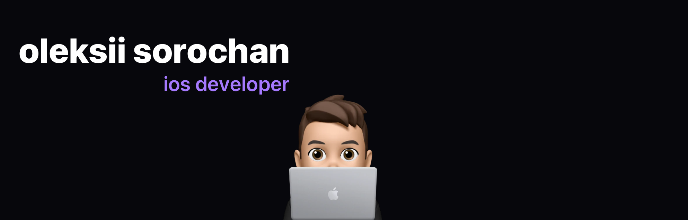

### Hello There 👨🏻‍💻⚔️🇺🇦



<!--
**oleksiiswift/oleksiiswift** is a ✨ _special_ ✨ repository because its `README.md` (this file) appears on your GitHub profile.

Here are some ideas to get you started:

- 🔭 I’m currently working on ...
- 🌱 I’m currently learning ...
- 👯 I’m looking to collaborate on ...
- 🤔 I’m looking for help with ...
- 💬 Ask me about ...
- 📫 How to reach me: ...
- 😄 Pronouns: ...
- ⚡ Fun fact: ...
-->

```swift
struct Oleksii {
	var email: String = "oleksii.codingkey@gmail.com"
	var linkedin: String = "linkedin.com/in/oleksiisorochan"
    	var code: [String] = ["Swift", "Objective-C"]
	var location: CLLocation = CLLocation(latitude: 50.44425167425206, longitude: 30.496931776896034)
    	var interests: [String] = ["Coding", "Photography", "Running", "Apple"]
	var mobile: [String] = ["IOS"]
    	var technologies: [String: [String]] = [
        	"ui": ["UIKit"],
        	"databases": ["Core Data", "Realm", "UserDefaults", "Keychain"],
		"networking": ["RESTful APIs", "URLSession", "Alamofire", "ObjectMapper"],
		"multithreading": ["Grand Central Dispatch", "Operation Queues", "Concurrency", "Async/Await"],
		"inAppPurchases": ["StoreKit2", "StoreKit", "SwiftyStoreKit"],
	        "other": ["MapKit",
			  "Core Location",
			  "AVFoundation",
			  "Core Animation",
			  "Photos Framework",
			  "Core Telephony",
			  "CallKit",
			  "Contacts Framework"],
		"notification": ["Push Notification Service", "Local Notifications", "User Notifications Framework"],		 
    ]
    var misc: [String] = ["AdMob", "Firebase", "Firebase Auth", "Amazon S3"]
    var challenge: String = "I work hard as an amateur runner to be able to run a marathon"
}


[](https://forthebadge.com)

